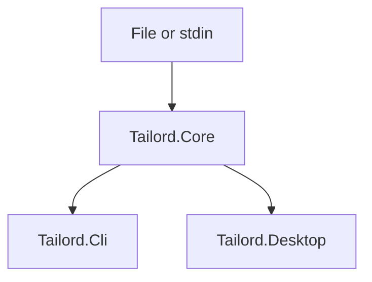

# Architecture

Tailord separates log processing from presentation. `Tailord.Core` must not
reference Avalonia, console APIs, or operating-system-specific UI types.

## Dependency rule

- `Tailord.Core` owns domain models and processing behavior.
- `Tailord.Cli` translates command-line input and renders text output.
- `Tailord.Desktop` owns Avalonia views, view models, and desktop integration.
- Tests target the core without loading a graphical environment.

Configuration persistence will be introduced behind core interfaces. The
desktop application will resolve the standard per-user data directory on each
operating system.

